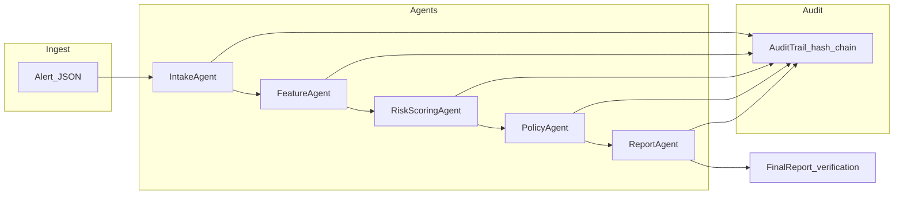

# Fraud Agent Orchestrator

Multi-agent **fraud triage** reference implementation: explicit pipeline stages (intake → features → risk → policy → report), **deterministic scoring** with optional **Ollama** narrative, **OPA** policy-as-code, **Temporal** workflows with supervisor **HITL**, **hash-chained audit** plus **HMAC-signed evidence**, **FastAPI** with RBAC scaffolding, and a **React** operator console.

**Documentation:** full Docker and curl runbook in [docs/DEMO.md](docs/DEMO.md). Interview-oriented vocabulary and code map in [docs/AGENTIC_AI_INTERVIEW_GUIDE.md](docs/AGENTIC_AI_INTERVIEW_GUIDE.md).

---

## Contents

1. [Capabilities](#capabilities)
2. [Architecture](#architecture)
3. [Repository layout](#repository-layout)
4. [Prerequisites](#prerequisites)
5. [Quick start](#quick-start)
6. [Running the stack](#running-the-stack)
7. [API](#api)
8. [Security and governance](#security-and-governance)
9. [Configuration](#configuration)
10. [Testing](#testing)
11. [Roadmap](#roadmap)
12. [License](#license)

---

## Capabilities

- **Multi-agent pipeline** — Each step is a small module with typed inputs/outputs; [`FraudOrchestrator`](src/fraud_agent_orchestrator/workflows/orchestrator.py) sequences agents and records audit events.
- **Policy above models** — Python rules plus [OPA/Rego](opa/policies/fraud.rego); merge semantics in [`execute_triage`](src/fraud_agent_orchestrator/services/triage_service.py).
- **Durable execution** — [Temporal](src/fraud_agent_orchestrator/temporal_layer/workflow.py) for retries, visibility, and supervisor signals; API **falls back** to in-process triage when Temporal is unavailable.
- **Persistence** — Async SQLAlchemy: cases, append-only audit ledger, drift checkpoints ([`db/models.py`](src/fraud_agent_orchestrator/db/models.py)).
- **Audit and evidence** — Per-run hash chain ([`security.py`](src/fraud_agent_orchestrator/security.py)); HMAC envelope over result + lineage ([`governance/evidence.py`](src/fraud_agent_orchestrator/governance/evidence.py)).
- **API hardening** — Rate limits (SlowAPI), CORS, `x-request-id`, JWT/RBAC when auth is enabled ([`settings/env.py`](src/fraud_agent_orchestrator/settings/env.py)).
- **Operator UI** — Vite + React console in `web/` (dev proxy to the API).

---

## Architecture

Single alert in → structured decision + audit + optional workflow persistence out.



| Stage | Role |
|--------|------|
| **IntakeAgent** | Schema validation and sanity checks. |
| **FeatureAgent** | Derived signals (geo mismatch, velocity, MCC buckets, etc.). |
| **RiskScoringAgent** | Deterministic score; optional Ollama note with timeout and fallback. |
| **PolicyAgent** | Hard rules and thresholds; can force review/escalate. |
| **ReportAgent** | Investigator-facing summary and structured `FinalReport`. |

**Surfaces:** Python package + `fraud-api` (FastAPI), `fraud-temporal-worker`, CLI (`python -m fraud_agent_orchestrator.cli`), and `web/` SPA.

---

## Repository layout

```text
fraud-agent-orchestrator/
  data/sample_transactions.json    # Demo alerts (CLI / manual API tests)
  docs/DEMO.md                     # Docker, env, curl examples
  docs/AGENTIC_AI_INTERVIEW_GUIDE.md
  docker-compose.yml               # Postgres, Redis, OPA (Temporal: CLI or external)
  opa/policies/fraud.rego
  src/fraud_agent_orchestrator/
    agents/                        # Intake, feature, risk, policy, report
    activities/                    # Temporal activities (triage, HITL persist)
    api/                           # FastAPI app, routes, auth, limits
    contracts/                     # Pydantic API contracts
    db/                            # Models, session, repository
    governance/                    # OPA client, evidence signing, lineage, drift hooks
    services/                      # execute_triage orchestration service
    settings/                      # env-backed settings
    temporal_layer/                # Workflow, worker, client
    workflows/orchestrator.py      # FraudOrchestrator (core graph)
    security.py                    # AuditTrail, user_id hashing, verify()
    config.py                      # Scoring thresholds, Ollama URL/timeouts
    cli.py
  tests/
  web/                             # Operator UI (npm)
```

---

## Prerequisites

- **Python 3.10+** (3.11+ recommended)
- **Node.js 18+** (for `web/`)
- **Optional:** [Ollama](https://ollama.com/) for live LLM risk notes (model configurable in `config.py`)
- **Optional:** Temporal dev server or cluster ([docs/DEMO.md](docs/DEMO.md))

---

## Quick start

**Python (editable install)**

```powershell
python -m venv .venv
.\.venv\Scripts\activate
pip install -e ".[dev]"
```

macOS / Linux:

```bash
python -m venv .venv
source .venv/bin/activate
pip install -e ".[dev]"
```

**CLI — batch triage (no DB)**

```powershell
python -m fraud_agent_orchestrator.cli run --input data\sample_transactions.json --pretty
```

**API + UI (local demo)**

Terminal A:

```powershell
fraud-api
```

Terminal B:

```powershell
cd web
npm install
npm run dev
```

Open **http://localhost:5173**. Vite proxies `/api` to `http://127.0.0.1:8000` by default.

Uvicorn equivalent: `python -m uvicorn fraud_agent_orchestrator.api.main:app --host 127.0.0.1 --port 8000`

**Production UI build:** `cd web && npm run build` → `web/dist/`. Set **`FRAUD_API_CORS_ORIGINS`** on the API to your deployed UI origin(s), or place both behind one reverse proxy.

---

## Running the stack

Postgres, Redis, OPA, Temporal worker, and scripted curls are documented in **[docs/DEMO.md](docs/DEMO.md)** (`docker compose`, `DATABASE_URL`, `fraud-temporal-worker`, etc.).

---

## API

Base URL (default): `http://127.0.0.1:8000`

| Method | Path | Description |
|--------|------|----------------|
| `GET` | `/api/health` | Liveness. |
| `GET` | `/metrics` | Metrics placeholder (extend with OTel / Prometheus in production). |
| `POST` | `/api/v1/triage` | Synchronous triage (no case row); same alert shape as sample JSON. Requires analyst/admin/supervisor role (dev bypass when `AUTH_DISABLED=true`). |
| `POST` | `/api/v1/cases` | Create case, start Temporal workflow when enabled; supports `Idempotency-Key` header. |
| `GET` | `/api/v1/cases` | List cases. |
| `GET` | `/api/v1/cases/{case_id}` | Case detail. |
| `GET` | `/api/v1/cases/{case_id}/evidence` | Evidence pack + signature metadata. |
| `POST` | `/api/v1/cases/{case_id}/signal/supervisor` | Supervisor HITL signal. |
| `POST` | `/api/v1/internal/drift-check` | Drift sample record (roles: **admin**, **auditor**). |
| `GET` | `/api/v1/internal/drift-recent` | Recent drift rows (**admin**, **auditor**, **analyst**). |

OpenAPI: **http://127.0.0.1:8000/docs**

**Example: sync triage response** (full responses also include `lineage`, `opa`, `needs_hitl`, `hitl_reason`)

```json
{
  "result": {
    "transaction_id": "...",
    "decision": "approve",
    "risk_score": 0.0,
    "reasons": [],
    "policy_violations": [],
    "investigator_summary": "...",
    "created_at_utc": "..."
  },
  "audit_verified": true,
  "audit_events": [],
  "evidence_signature": "..."
}
```

Errors: `400` with `{"detail":"..."}` for invalid payloads.

---

## Security and governance

| Area | Implementation |
|------|------------------|
| Audit integrity | SHA-256 chain over canonical step payloads; `audit_verified` from `AuditTrail.verify()`. |
| Evidence authenticity | HMAC-SHA256 envelope (`governance/evidence.py`); case rows store `evidence_signature` where applicable. |
| PII in audit payloads | Raw `user_id` replaced with `user_id_sha256` after intake. |
| AuthZ | JWT + role checks when `AUTH_DISABLED=false`; dev actor when `true`. |
| Rate limiting | SlowAPI on hot routes. |

**Production checklist:** real IdP (issuer, audience, JWKS), strong `EVIDENCE_HMAC_SECRET`, managed Postgres, Temporal namespace isolation, TLS, and SIEM export of audit/evidence — treat localhost defaults as **development only**.

---

## Configuration

**Scoring and Ollama:** [`src/fraud_agent_orchestrator/config.py`](src/fraud_agent_orchestrator/config.py) — thresholds, `ollama_url`, `ollama_model`, `ollama_timeout_seconds`, `max_audit_payload_chars`.

**Environment (API / platform):**

| Variable | Default | Meaning |
|----------|---------|---------|
| `FRAUD_API_HOST` | `127.0.0.1` | API bind host. |
| `FRAUD_API_PORT` | `8000` | API bind port. |
| `FRAUD_API_CORS_ORIGINS` | local Vite origins | Comma-separated browser origins. |
| `DATABASE_URL` | SQLite (dev) | Async SQLAlchemy DSN (`postgresql+asyncpg://...` in production). |
| `REDIS_URL` | optional | Redis for future caching / rate-limit backends. |
| `TEMPORAL_ADDRESS` | `localhost:7233` | Temporal frontend. |
| `TEMPORAL_ENABLED` | `true` | If Temporal is unreachable, sync paths fall back to in-process triage. |
| `OPA_URL` | `http://127.0.0.1:8181` | OPA HTTP API; empty/disabled skips remote policy. |
| `AUTH_DISABLED` | `true` | Dev bypass with full RBAC roles for local demos. |
| `EVIDENCE_HMAC_SECRET` | dev placeholder | **Rotate** for any shared or production environment. |
| OIDC-related vars | — | See `settings/env.py` when wiring a real IdP. |

---

## Testing

```powershell
pytest -q
```

---

## Sample data

[`data/sample_transactions.json`](data/sample_transactions.json): low-risk approve, high-risk / velocity pattern, and **restricted geography** to demonstrate **policy overriding** soft heuristics.

---

## Roadmap

Reasonable next increments: OpenTelemetry across API → Temporal → activities, golden-set eval in CI, KMS-backed signing for evidence exports, hardened OIDC defaults, workflow status in the UI.

---

## License

Portfolio and educational use. Forks are welcome; note substantive extensions in your own README if you ship a derivative.
