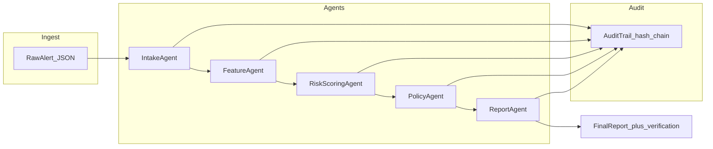

# Fraud Agent Orchestrator

**Multi-agent fraud triage** with explicit agent roles, deterministic scoring, policy gates, optional local LLM reasoning (Ollama), **tamper-evident audit chaining**, a **FastAPI** surface, and a **cinematic React + Three.js** operator console for demos.

This README is written so you can **walk an interviewer through the repo end-to-end** without opening every file first.

---

## Table of contents

1. [Is this impressive and demo-ready?](#is-this-impressive-and-demo-ready)
2. [Elevator pitch (30 seconds)](#elevator-pitch-30-seconds)
3. [Interview walkthrough script](#interview-walkthrough-script)
4. [Architecture](#architecture)
5. [Repository map](#repository-map)
6. [Prerequisites](#prerequisites)
7. [Install and run](#install-and-run)
8. [Three ways to drive the system](#three-ways-to-drive-the-system)
9. [API reference](#api-reference)
10. [Security, privacy, and auditability](#security-privacy-and-auditability)
11. [Configuration](#configuration)
12. [Sample data and what to expect](#sample-data-and-what-to-expect)
13. [Design decisions you can cite](#design-decisions-you-can-cite)
14. [Troubleshooting](#troubleshooting)
15. [Enterprise platform](#enterprise-platform)
16. [Roadmap (honest next steps)](#roadmap-honest-next-steps)
17. [Agentic AI interview study guide](#agentic-ai-interview-study-guide)

---

## Is this impressive and demo-ready?

**Demo-ready: yes**, for a portfolio or technical interview if you:

1. Run the **CLI** once on `data/sample_transactions.json` to show batch output and JSON structure.
2. Run **API + web console** (two terminals) and execute triage on the preloaded demo payload and one edited scenario (e.g. change `country` to `US` and `amount` low) to show **approve vs escalate** and **audit_verified**.
3. Optionally start **Ollama** so `RiskScoringAgent` shows real LLM notes instead of the deterministic fallback (still safe if Ollama is down).

**Impressive for what it is:** a **coherent vertical slice**—not a full bank deployment. You can credibly discuss:

- Multi-agent **separation of concerns** (intake, features, risk, policy, report).
- **Deterministic core** with bounded LLM augmentation and graceful degradation.
- **Audit chain** (hash-linked events + verification flag) and **PII minimization** (hashed `user_id` in audit payloads).
- **Product-shaped surfaces**: CLI for batch/repro, HTTP API for integration, UI for narrative.

Be upfront that **auth (OIDC), Temporal, Postgres, OPA** are natural **phase-2** upgrades; the README roadmap section names them so you sound intentional, not unaware.

---

## Elevator pitch (30 seconds)

> “I built a fraud triage orchestrator where each step is a dedicated agent: validate the alert, engineer features, score risk with heuristics plus an optional local LLM, enforce hard policy rules, then emit an investigator summary. Every run produces a **hash-chained audit trail** you can verify in software, and raw `user_id` never lands in the audit log—we hash it. There’s a FastAPI triage endpoint and a React operator UI so I can demo the same pipeline to engineers and to stakeholders.”

---

## Interview walkthrough script

Use this as a **5–10 minute** guided tour. Adjust depth to the role (ML vs platform vs security).

| Step | What you do | What you say |
|------|-------------|----------------|
| 1 | Open this README, “Architecture” diagram | “High level: alerts go through a fixed pipeline; policy can override soft risk; everything worth disputing is logged in order with hashes.” |
| 2 | Open `src/fraud_agent_orchestrator/agents/` | “Each folder is one responsibility—easy to test, swap, or put behind different SLAs later.” |
| 3 | Open `workflows/orchestrator.py` | “Single orchestrator class wires the agents and owns the audit trail lifecycle for one transaction.” |
| 4 | Open `security.py` | “Chain: each event hashes timestamp, step, canonical JSON payload, and previous hash—tampering breaks `verify()`.” |
| 5 | Terminal: `pip install -e .` then CLI run (see [Install and run](#install-and-run)) | “CLI proves the core is scriptable and CI-friendly.” |
| 6 | Terminal: `fraud-api` + `cd web && npm run dev`, open UI | “Same engine behind HTTP; UI is for storytelling and panel demos.” |
| 7 | In UI: run triage, expand audit JSON | “Interviewers can see structured evidence, not a black-box chat transcript.” |
| 8 | Mention Ollama optional | “LLM is augmenting; if the model is down, scoring still completes with a documented fallback string.” |

**If they ask “production?”** Answer: “Next I’d add OIDC on the API, persist cases and audit to an append-only store, and run the graph in Temporal for retries and human-in-the-loop signals—that’s already how I’d sell the roadmap.”

---

## Architecture

Conceptual pipeline (one alert in, one verdict out):



- **IntakeAgent**: required fields, types, basic sanity (e.g. non-negative amount).
- **FeatureAgent**: derived booleans and ratios (geo mismatch, velocity, risky MCC bucket, etc.).
- **RiskScoringAgent**: deterministic score from features + **Ollama** call with timeout; fallback text if unreachable.
- **PolicyAgent**: hard rules (e.g. restricted geography, credential abuse signals) and thresholds layered on risk.
- **ReportAgent**: single investigator-facing string plus structured `FinalReport`.

**Surfaces**

| Surface | Role |
|---------|------|
| `FraudOrchestrator` | Core engine; used by CLI and API today. |
| `fraud_agent_orchestrator.cli` | Batch JSON from disk; great for reproducibility. |
| FastAPI `api/main.py` | JSON in/out for UI and future services. |
| `web/` | Vite + React + Three.js + Framer Motion console. |

---

## Repository map

```text
fraud-agent-orchestrator/
  README.md                 ← you are here (interview guide + ops)
  pyproject.toml            ← package metadata, deps, console scripts
  data/
    sample_transactions.json   ← three scenarios: low / hot / restricted geo
  src/fraud_agent_orchestrator/
    __init__.py
    config.py               ← scoring thresholds, Ollama URL/model/timeouts
    models.py               ← dataclasses: alert, features, risk, policy, report
    security.py             ← hash_user_id, AuditTrail + verify()
    ollama_client.py        ← minimal HTTP client + fallback
    cli.py                  ← `run --input ...`
    api/main.py             ← FastAPI: /api/health, /api/v1/triage
    agents/                 ← one module per agent
    workflows/orchestrator.py  ← FraudOrchestrator
  web/                      ← operator UI (npm)
    package.json
    vite.config.ts          ← dev proxy /api → localhost:8000
    src/
      App.tsx
      api.ts
      components/           ← SceneBackground (R3F), TriageConsole, etc.
```

---

## Prerequisites

- **Python 3.10+** (3.11+ recommended).
- **Node.js 18+** (for `web/`).
- **Optional:** [Ollama](https://ollama.com/) running locally if you want live LLM text in risk notes (`llama3.1:8b` or change `config.py`).

---

## Install and run

**Python (once per machine or venv)**

```bash
python -m venv .venv
```

Windows:

```powershell
.\.venv\Scripts\activate
pip install -e .
```

macOS/Linux:

```bash
source .venv/bin/activate
pip install -e .
```

**Node (for UI, once per clone)**

```bash
cd web
npm install
```

---

## Three ways to drive the system

### 1) CLI — batch, scriptable, CI-friendly

```powershell
python -m fraud_agent_orchestrator.cli run --input data\sample_transactions.json --pretty
```

Expect an array of objects, each with `result`, `audit_verified`, and `audit_events`.

### 2) API — integration-shaped

Start server:

```powershell
fraud-api
```

Equivalent:

```powershell
python -m uvicorn fraud_agent_orchestrator.api.main:app --host 127.0.0.1 --port 8000
```

Smoke check:

```powershell
curl http://127.0.0.1:8000/api/health
```

### 3) Web console — stakeholder / panel demo

Terminal A: API (as above).  
Terminal B:

```powershell
cd web
npm run dev
```

Open **http://localhost:5173**. The Vite dev server **proxies** `/api/*` to `http://127.0.0.1:8000`.

**Production UI:** `cd web && npm run build` produces `web/dist/`. Serve static files behind nginx, S3+CloudFront, etc. Set **`FRAUD_API_CORS_ORIGINS`** on the API to your real UI origin (comma-separated), or put UI and API behind one reverse proxy so CORS is trivial.

---

## API reference

Base URL (default local): `http://127.0.0.1:8000`

| Method | Path | Description |
|--------|------|-------------|
| `GET` | `/api/health` | Liveness: `{"status":"ok"}`. |
| `POST` | `/api/v1/triage` | Body: **single** alert JSON (same shape as `data/sample_transactions.json` entries). Returns orchestrator output below. |

**Success response shape** (`200`)

```json
{
  "result": {
    "transaction_id": "...",
    "decision": "approve | review | escalate",
    "risk_score": 0.0,
    "reasons": ["..."],
    "policy_violations": ["..."],
    "investigator_summary": "...",
    "created_at_utc": "..."
  },
  "audit_verified": true,
  "audit_events": [
    {
      "timestamp_utc": "...",
      "step": "received_alert | intake_complete | ...",
      "payload": {},
      "prev_hash": "...",
      "event_hash": "..."
    }
  ]
}
```

**Error** (`400`): invalid payload / missing fields — `{"detail":"..."}` (FastAPI).

Interactive docs (optional): `http://127.0.0.1:8000/docs` (Swagger UI).

---

## Security, privacy, and auditability

What is implemented **today**:

| Topic | Implementation |
|--------|----------------|
| Audit trail | Each step appends an event; **SHA-256** over `timestamp \| step \| canonical_json(payload) \| prev_hash`. |
| Integrity | `audit_verified` is `AuditTrail.verify()` on the returned chain. |
| PII in logs | Raw `user_id` is replaced with **`user_id_sha256`** in audit payloads after intake. |
| Payload size | Very large payloads can be truncated in audit via `max_audit_payload_chars` in `config.py`. |

What is **not** implemented yet (say this clearly in interviews):

- No **OIDC/JWT** on the API (open on localhost by design for the portfolio demo).
- No **encrypted persistence** or centralized SIEM export.
- No **HMAC/signing** of the whole response envelope (chain is self-verifying; external signing is a small addition).

That gap list is a feature: it shows you know the boundary between **demo** and **regulated production**.

---

## Configuration

**Python scoring / Ollama** — edit [`src/fraud_agent_orchestrator/config.py`](src/fraud_agent_orchestrator/config.py):

- `ollama_url`, `ollama_model`, `ollama_timeout_seconds`
- `review_threshold`, `escalate_threshold`
- Feature thresholds and penalties (`high_amount_threshold`, `geo_mismatch_penalty`, etc.)
- `max_audit_payload_chars`

**API server** — environment variables:

| Variable | Default | Meaning |
|----------|---------|---------|
| `FRAUD_API_HOST` | `127.0.0.1` | Bind host for `fraud-api`. |
| `FRAUD_API_PORT` | `8000` | Bind port. |
| `FRAUD_API_CORS_ORIGINS` | `http://localhost:5173,http://127.0.0.1:5173` | Allowed browser origins (comma-separated). |
| `DATABASE_URL` | SQLite file (dev) | Async SQLAlchemy DSN; use `postgresql+asyncpg://...` in production. |
| `TEMPORAL_ADDRESS` | `localhost:7233` | Temporal frontend gRPC target. |
| `TEMPORAL_ENABLED` | `true` | If triage cannot reach Temporal, API falls back to in-process triage. |
| `OPA_URL` | `http://127.0.0.1:8181` | Open Policy Agent; set empty to skip. |
| `AUTH_DISABLED` | `true` | Dev bypass with full RBAC roles; set `false` + `OIDC_*` for real JWTs. |
| `EVIDENCE_HMAC_SECRET` | dev string | Secret for signed evidence envelopes. |

---

## Enterprise platform

Implemented components (full runbook: [docs/DEMO.md](docs/DEMO.md)):

| Layer | What |
|-------|------|
| **API** | FastAPI routers under `/api/v1`: `POST /cases`, `GET /cases`, `GET /cases/{id}`, `GET /cases/{id}/evidence`, `POST /cases/{id}/signal/supervisor`, `POST /triage` (sync), drift hooks. |
| **AuthZ** | `RoleChecker` + JWT (JWKS) when `AUTH_DISABLED=false`; dev user when `true`. |
| **Rate limits** | SlowAPI middleware + per-route limits on hot paths. |
| **Temporal** | `FraudTriageWorkflow`: triage activity with retries; optional HITL wait + `persist_hitl_activity`. Worker: `fraud-temporal-worker`. |
| **Persistence** | SQLAlchemy async: `cases`, `audit_ledger`, `drift_checkpoints`. |
| **Governance** | OPA HTTP client + `opa/policies/fraud.rego`; lineage metadata; HMAC evidence signing. |
| **Docker** | `docker compose` — Postgres, Redis, OPA (Temporal via CLI or external). |

---

## Sample data and what to expect

[`data/sample_transactions.json`](data/sample_transactions.json) has three rows:

| # | Intent | Typical outcome |
|---|--------|-----------------|
| 1 | Clean low-amount domestic card-present | Low risk, **`approve`**, few audit steps. |
| 2 | High amount + geo mismatch + velocity + auth failures | High risk + policy flags, often **`escalate`**. |
| 3 | Restricted geography (`IR`) | Policy-driven **`escalate`** even if raw heuristics differ. |

Use row 3 to explain **policy overrides soft scoring**—a favorite interviewer question.

---

## Design decisions you can cite

1. **Deterministic risk core** so regression tests and incident replay are possible; LLM adds narrative, not unbounded authority over the numeric score in this slice.
2. **Single orchestrator class** keeps the demo readable; a larger codebase would split “application service” from “domain” and add a workflow engine.
3. **Hash chain in-process** demonstrates understanding of **tamper evidence** without requiring a blockchain or external notary.
4. **FastAPI + static SPA** mirrors how many teams ship internal ops tools: Python for heavy logic, JS for rich UX.
5. **Three.js background** is cosmetic but intentional: it signals **operator-console** DNA, not “another chat window.”

---

## Troubleshooting

| Symptom | Likely cause | Fix |
|---------|----------------|-----|
| UI shows network / fetch error | API not running or wrong port | Start `fraud-api` or uvicorn on **8000**; check Terminal A. |
| `ModuleNotFoundError: fraud_agent_orchestrator` | Package not installed / wrong cwd | `pip install -e .` from repo root; run from activated venv. |
| Ollama always “unavailable” in copy | Ollama not running or wrong URL/model | Start Ollama; align `config.py` with your model tag. |
| CORS error in browser (production) | UI origin not in allow list | Set `FRAUD_API_CORS_ORIGINS` to your UI URL(s). |
| `npm run dev` fails | Node too old | Use Node 18+. |

---

## Roadmap (honest next steps)

Already in-repo: **Temporal workflows**, **Postgres/SQLite persistence**, **append-only audit rows**, **OPA bundle**, **JWT/RBAC scaffolding**, **HMAC evidence**, **drift hook**, **Docker Compose** deps, **pytest** smoke tests.

Next hardening:

1. **AuthN** — wire a real IdP (Auth0/Okta/Azure AD); tune `OIDC_JWKS_URL` / audience / issuer.
2. **Evidence UX** — ZIP export with PDF investigator summary + raw JSON chain.
3. **Evaluation** — labeled slice or synthetic generator; precision@k, review load, escalation quality.
4. **Observability** — OpenTelemetry traces API → Temporal → activities → Ollama.
5. **Temporal UX** — workflow status UI + query handlers for live progress.

---

## License and attribution

Portfolio / educational use. If you fork for interviews, keep a short note in your README pointing to what **you** extended vs the baseline.

---

**Bottom line:** Run **CLI + UI** once before the interview, step through the **walkthrough script**, and use **Roadmap** to steer “what’s next” questions. That combination reads as **demo-ready** and **architecturally self-aware**, which is what senior panels usually optimize for.

---

## Agentic AI interview study guide

For a **structured interview prep** document (vocabulary, theme → code map, drills, pitches, honest gaps), use **[docs/AGENTIC_AI_INTERVIEW_GUIDE.md](docs/AGENTIC_AI_INTERVIEW_GUIDE.md)**. It is written so you can study from the repo alone and explain the system like a staff-level agentic AI engineer.
